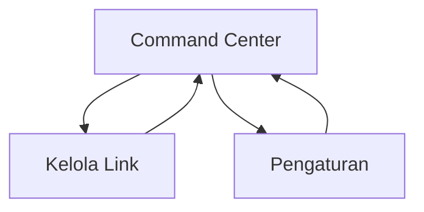

## 1. Product Overview
Aplikasi mobile “Command Center” berisi tombol/shortcut cepat ke banyak link (dashboard/tools) dalam satu tempat.
Kamu bisa mengelompokkan dan mengedit daftar link agar akses kerja harian lebih cepat.

## 2. Core Features

### 2.1 User Roles
Tidak ada pembedaan role; aplikasi dipakai oleh satu pengguna di perangkat.

### 2.2 Feature Module
Aplikasi ini terdiri dari halaman utama berikut:
1. **Command Center**: grid tombol shortcut, pengelompokan/section, aksi buka link.
2. **Kelola Link**: daftar link + grup, tambah/ubah/hapus, atur urutan.
3. **Pengaturan**: preferensi tampilan & perilaku membuka link.

### 2.3 Page Details
| Page Name | Module Name | Feature description |
|---|---|---|
| Command Center | Header & Navigasi | Menampilkan judul aplikasi + akses ke Kelola Link dan Pengaturan. |
| Command Center | Grid Shortcut | Menampilkan tombol shortcut dalam grid; menampilkan label + ikon/warna; menyusun berdasarkan grup dan urutan. |
| Command Center | Buka Link | Membuka URL saat tombol ditekan (in-app browser atau browser eksternal sesuai pengaturan). |
| Command Center | Empty State | Menampilkan arahan untuk menambah link saat daftar masih kosong. |
| Kelola Link | Daftar Grup | Menampilkan daftar grup; tambah/ubah nama/hapus grup; atur urutan grup. |
| Kelola Link | Daftar Link (CRUD) | Menampilkan link per grup; tambah link baru; ubah judul/URL/ikon/warna/grup; hapus link. |
| Kelola Link | Reorder | Mengubah urutan link dalam grup (drag & drop atau tombol naik/turun). |
| Kelola Link | Validasi | Memvalidasi format URL; mencegah simpan jika URL kosong/tidak valid. |
| Pengaturan | Perilaku Buka Link | Memilih mode buka link: in-app browser vs browser eksternal. |
| Pengaturan | Tampilan | Mengatur tema (terang/gelap/sistem) dan kepadatan grid (mis. 2–4 kolom tergantung layar). |

## 3. Core Process
Alur utama pengguna:
1) Kamu membuka aplikasi dan melihat grid shortcut pada Command Center.
2) Kamu menekan sebuah shortcut untuk membuka dashboard/tool.
3) Jika perlu perubahan, kamu masuk ke Kelola Link untuk menambah/mengubah/menghapus link dan mengatur urutan serta grup.
4) Kamu mengatur preferensi buka link dan tampilan melalui Pengaturan.

