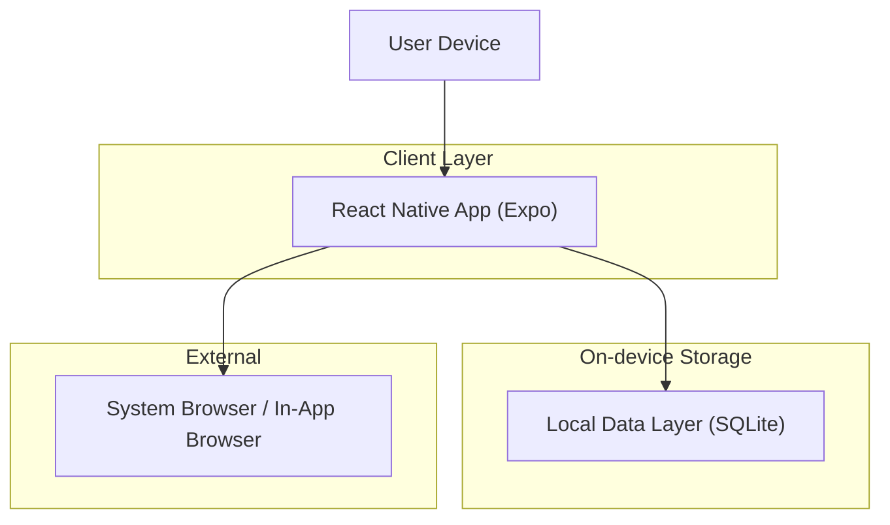
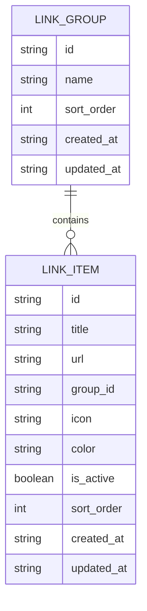

## 1.Architecture design


## 2.Technology Description
- Frontend (mobile): React Native (Expo) + TypeScript
- Navigation: react-navigation
- State management: Zustand (atau Context API jika ingin sangat minimal)
- Local storage: SQLite (expo-sqlite)
- Link handling: expo-linking + expo-web-browser (untuk in-app browser)
- Backend: None

## 3.Route definitions
| Route | Purpose |
|---|---|
| /command-center | Halaman utama grid shortcut dan akses cepat ke halaman lain |
| /manage-links | Kelola grup dan link (CRUD + urutan) |
| /settings | Preferensi tampilan dan perilaku membuka link |

## 6.Data model(if applicable)

### 6.1 Data model definition


### 6.2 Data Definition Language
Link Group (link_groups)
```
CREATE TABLE IF NOT EXISTS link_groups (
  id TEXT PRIMARY KEY,
  name TEXT NOT NULL,
  sort_order INTEGER NOT NULL DEFAULT 0,
  created_at TEXT NOT NULL,
  updated_at TEXT NOT NULL
);

CREATE INDEX IF NOT EXISTS idx_link_groups_sort_order
  ON link_groups(sort_order);
```

Link Item (link_items)
```
CREATE TABLE IF NOT EXISTS link_items (
  id TEXT PRIMARY KEY,
  title TEXT NOT NULL,
  url TEXT NOT NULL,
  group_id TEXT,
  icon TEXT,
  color TEXT,
  is_active INTEGER NOT NULL DEFAULT 1,
  sort_order INTEGER NOT NULL DEFAULT 0,
  created_at TEXT NOT NULL,
  updated_at TEXT NOT NULL
);

CREATE INDEX IF NOT EXISTS idx_link_items_group_id
  ON link_items(group_id);

CREATE INDEX IF NOT EXISTS idx_link_items_group_sort
  ON link_items(group_id, sort_order);
```

Catatan:
- group_id adalah foreign key logis (tanpa constraint fisik) agar fleksibel.
- created_at/updated_at disimpan sebagai ISO string untuk sederhana dan portable.
